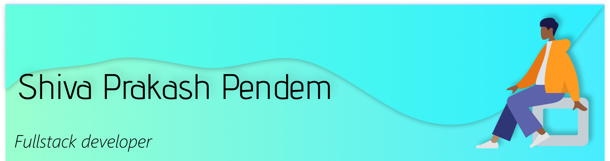

<!---->

Hello there!

I'm a developer who's shy at first, but gets very outgoing once I get comfortable with people. I like mingling with people, playing games when I'm free or watch movie rants when I'm bored.

I try to keep up with latest technologies, but learning all of them would be impossible, so I usually stick to below areas, but that doesn't mean that I won't be learning some new technology, because I love learning stuff.
   - Languages: HTML5, CSS3, JavaScript (ES6+), Node.js, TypeScript, Java, Python
   - Frameworks: jQuery, SASS, Bootstrap, Tailwind, ReactJS, Express
   - Databases: SQL (MySQL), NoSQL (MongoDB)
   - Tools: Figma, Embedded JavaScript (EJS), Source Control (Git), CLI tools

<!-- Here are my socials, if you want to connect with or contact me.
[LinkedIn](https://www.linkedin.com/in/shiva-pendem) -->

I hope you have a good day. :)

<!---
shivaprakash-sudo/shivaprakash-sudo is a ✨ special ✨ repository because its `README.md` (this file) appears on your GitHub profile.
You can click the Preview link to take a look at your changes.
--->
